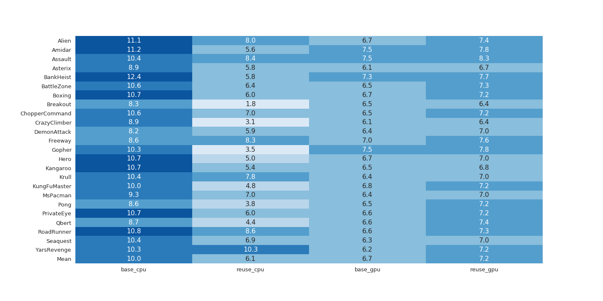
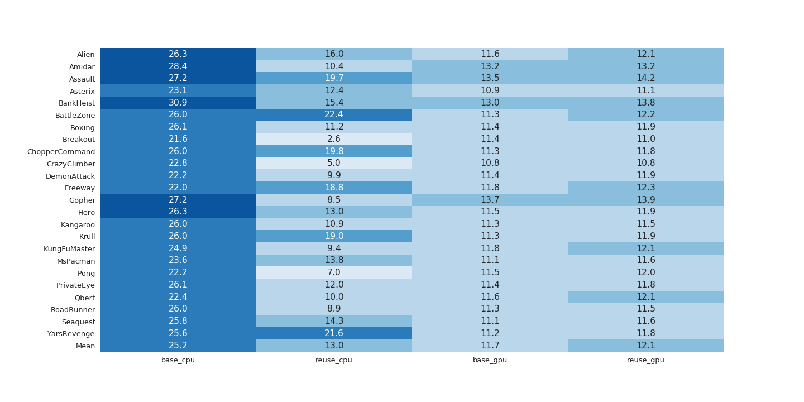
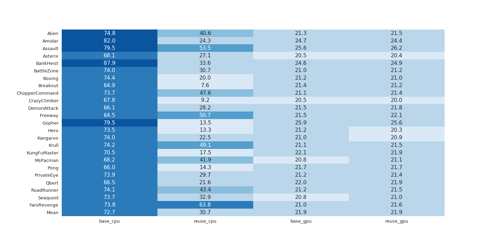
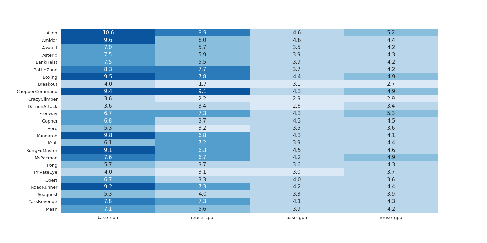
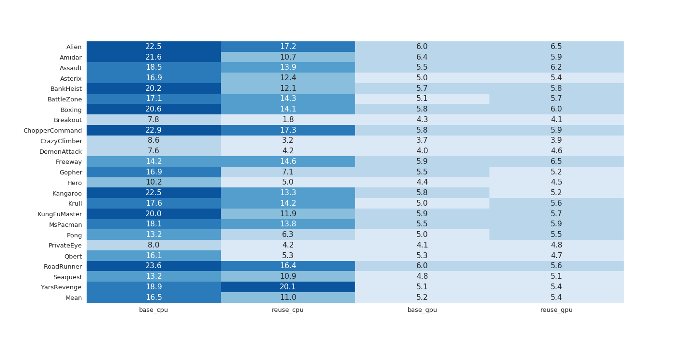
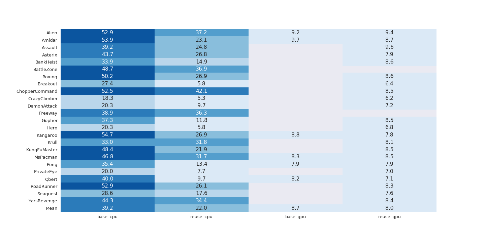
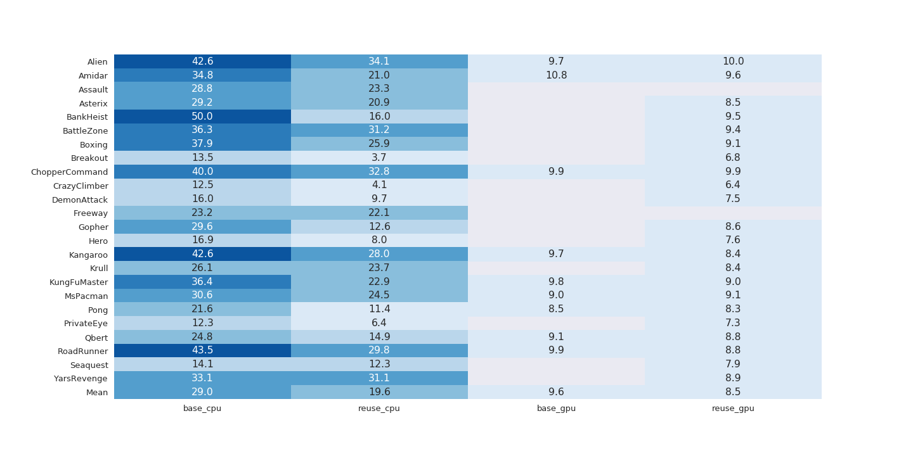
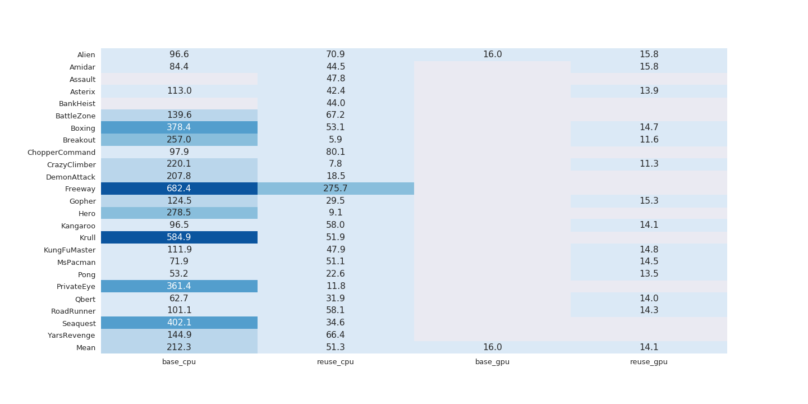

Code for paper "Reusing Convolutional Activations from Frame to Frame to Speed up Learning and Inference"

#### Acknowledgements:
[Andrej Karpathy](http://karpathy.github.io/2016/05/31/rl/) for main training loop  
[Pytorch contributors](https://github.com/pytorch/examples/blob/master/reinforcement_learning/reinforce.py) REINFORCE functions select_action() and updade_policy()/finish_episode()

### Results - Atari
Results are averaged over 10 runs. The policy network used for the experiments consists of 2 convolutional layer followed by a dense layer.

#### Inference: time to run 3000 steps (in seconds), grayscale, downsampled by a factor of 4 in each dimension

Number of filters in convolutional layers one and two: 20/40

Number of filters in convolutional layers one and two: 40/80

Number of filters in convolutional layers one and two: 80/160

#### Inference: time to run 3000 steps (in seconds), grayscale, downsampled by a factor of 2 in each dimension

Number of filters in convolutional layers one and two: 20/40

Number of filters in convolutional layers one and two: 40/80

Number of filters in convolutional layers one and two: 80/160

#### Training: time to run 3000 steps (in seconds), grayscale, downsampled by a factor of 4 in each dimension

Number of filters in convolutional layers one and two: 20/40

Number of filters in convolutional layers one and two: 40/80

Number of filters in convolutional layers one and two: 80/160

#### Training: time to run 3000 steps (in seconds), grayscale, downsampled by a factor of 2 in each dimension

Number of filters in convolutional layers one and two: 20/40

Number of filters in convolutional layers one and two: 40/80

